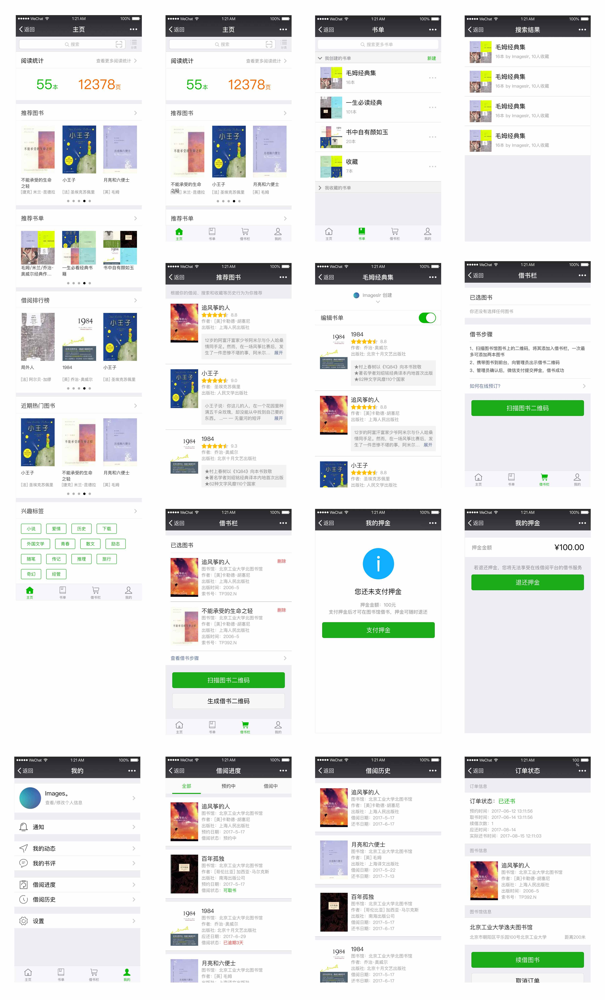

## 在线借书平台

### 扫码体验 (最近云服务器到期，不可用，请在本地开发者工具运行)

<!--  -->

> 首次使用时 (例如: 获取验证码)，可能会有错误弹窗。多尝试几次即可。

<div id="mock-server"></div>

### 运行本地 Mock Server

本项目仅提供小程序的开源代码，暂无对应后端服务，需要自行在本地启动 Mock Server。

推荐运行环境：nodejs v10.10.0，gulp v3.9.1。启动方法如下：

```
# 在项目根目录下执行
cd simplest-mock-server

# 安装依赖
npm install

# 启动 mock 服务
gulp mock
```

默认启动端口是 3000，如有区别，请修改 `servers/index.ts` 中的 `BASE_URL` 常量。关闭 `gulp mock` 终端进程，模拟网络中断场景；修改 [/simplest-mock-server/server.js](https://github.com/imageslr/weapp-library/tree/master/simplest-mock-server/server.js) 中的延迟时长，模拟 timeout 场景。

如果在 mac 启动时报错：“无法打开 fse.node：来自身份不明的开发者“，请前往“系统设置 - 安全性与隐私 - 通用 - 允许从以下位置下载的 App”，点击“仍然允许“，然后再次执行 `gulp mock`。这里可能会有两次错误。

> 这个功能拆分到了单独的仓库里，请查看 [simplest-mock-server](https://github.com/imageslr/simplest-mock-server)，**一个开箱即用的搭建本地 mock 接口的工具**。

### 文档

[点击查看](https://www.yuque.com/wangxiangjiaww/msxq7r/vrp7ult1a0cp6hzg)

### UI



### 文件结构

```
.
├── servers                  // 网络请求封装
├── app.js
├── app.json
├── app.wxss
├── component-demos       // 组件展示
├── components            // 可复用组件
│   ├── async-button      // 异步按钮
│   ├── async-switch      // 异步切换器
│   ├── collapse          // 可折叠容器
│   ├── load-more         // 加载更多
│   ├── no-data           // 暂无数据
│   ├── panel             // 带导航标题的面板
│   ├── popup             // 底部弹出层
│   ├── rate              // 可评半星的评分组件
│   ├── search-bar        // 带遮罩的搜索框
│   ├── send-code         // 发送验证码按钮
│   ├── spinner           // 加载中动画
│   ├── sticky            // 固定页头
│   ├── sticky-2          // 固定页头的另一种实现
│   ├── tab-bar           // 标签页
│   ├── toast             // 弹出提示
│   └── toptip            // 顶部提示
├── images                // 图标
├── package.json
├── pages                 // 页面，子页面在父页面的children文件夹中
│   └─components          // 与业务相关的特殊组件
├── mock                  // Mock Server
│   └── data              // Get/Post/Delete 等接口的 mockjs 模板文件
├── project.config.json
├── styles                // 样式
├── templates             // 模板
│   ├── library-list      // 图书馆列表
│   ├── page-status-indicator // 页面加载状态，带有一个“重新加载”按钮
│   └── showcase          // 图书项目
└── utils                 // 辅助模块
    ├── biz-helper.wxs    // 业务相关辅助函数，用于wxml中
    ├── constant.js       // 业务常量
    ├── constant.wxs      // 业务常量，用于wxml中
    ├── es6-promise.js    // Promise语法支持
    ├── event.js          // 全局事件
    ├── permission.js     // 登录鉴权
    ├── promise-polyfill.js // Promise.finally()语法
    ├── promisify.js      // 微信小程序API Promise化
    ├── qrcode.js         // 二维码生成
    ├── tip.js            // 使用帮助
    ├── utils.js          // 辅助函数
    ├── validator.js      // 正则校验器
    └── fundebug.js       // 错误监控
```

### 代码规范

遵循 [JavaScript Standard Style](https://standardjs.com/readme-zhcn.html)
